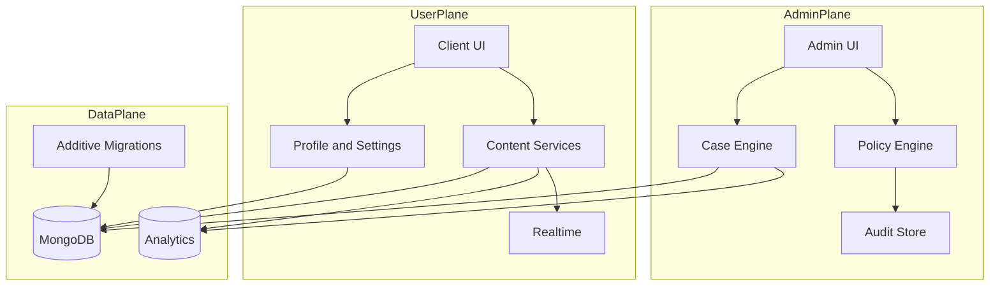

# 50-Feature Expansion: Implementation Specification

## Purpose
This document operationalizes the 50-feature roadmap (25 admin, 25 user) into implementation-ready contracts, epics, work lanes, and rollout safety controls.

It is designed for execution either:
- as phase-wide batches, or
- as parallel subworker lanes with strict integration gates.

## System Map

## Phase 1 Foundations: Detailed Specs and Contracts

### Deliverables in scope
- Admin features 1-6.
- User features 3, 10, 13, 15, 24.

### A. Contract: Admin Saved Views
- **Storage key format**: `admin:saved_view:<user_id>:<slug>`.
- **Payload shape**:
  - `name`, `description`, `route`, `filters`, `sort`, `columns`, `version`.
- **Validation**:
  - max 50 saved views per admin user.
  - saved filter clauses must map to allowlisted query params.
- **API**
  - `GET /admin/views`
  - `POST /admin/views`
  - `PATCH /admin/views/:id`
  - `DELETE /admin/views/:id`

### B. Contract: Rule-Based Auto-Triage
- **Input**: report payload, reporter metadata, historical strike profile.
- **Output**:
  - `severity`, `priority`, `triage_reason[]`, `confidence_score`.
- **Rules config model**:
  - `rule_id`, `enabled`, `conditions[]`, `actions[]`, `weight`.
- **Hard constraints**:
  - no auto-resolution.
  - owner-only enablement of high-impact rules.

### C. Contract: Bulk Case Actions
- **Endpoint**: `POST /safety/reports/bulk/actions`.
- **Request**:
  - `ids[]`, `action`, `reason`, `assignee_id`, `dry_run`.
- **Behavior**:
  - if `dry_run=true`, return permission and validation results only.
  - partial success allowed with per-item result map.
- **Audit**:
  - one parent audit event + child case events.

### D. Contract: Duplicate Cluster Management
- **Data model**:
  - `cluster_id`, `primary_report_id`, `related_report_ids[]`, `merge_reason`.
- **Endpoints**:
  - `POST /safety/reports/:id/cluster`
  - `PATCH /safety/reports/cluster/:cluster_id`
  - `POST /safety/reports/:id/merge-into/:primary_id`

### E. Contract: SLA Policy Editor
- **Policy schema**:
  - `category`, `severity`, `target_minutes`, `escalation_minutes`, `owner_group`.
- **Runtime fields**:
  - `sla_deadline`, `breach_state`, `breach_timestamp`.
- **Validation**:
  - no negative targets.
  - escalation must be greater than target.

### F. Contract: Staff Shift Handoff
- **Handoff package**:
  - open cases, recently breached cases, assignee load, unresolved appeals, notes.
- **Endpoint**:
  - `POST /admin/staff/handoff`.
- **Export format**:
  - JSON and markdown summary.

### G. User Foundation Contracts

#### Profile Themes v2
- `theme_preset`, `theme_accent`, `contrast_mode`, `reduced_motion`, `density`.
- allowlist for theme fields to prevent CSS injection.

#### Server Identity Profiles
- per-server profile document:
  - `server_id`, `nickname`, `avatar`, `accent`, `updated_at`.

#### Accessibility Pack
- stable settings keys:
  - `a11y:reduced_motion`
  - `a11y:high_contrast`
  - `a11y:font_scale`
  - `a11y:line_height`

#### Privacy Center
- keys grouped by domain:
  - `privacy:profile_visibility`
  - `privacy:presence_visibility`
  - `privacy:message_request_policy`

#### Personalized Update Feed
- event classification:
  - `security`, `feature`, `community`, `safety`.
- relevance ranking:
  - feature usage + account tenure + dismissed items.

## Phase 2 Power Features: Blueprints

### Deliverables in scope
- Admin features 7-15.
- User features 1-2 and 4-9.

### Soundboards Full Implementation
- **Core entities**
  - `soundboard`
  - `sound_item`
  - `sound_item_moderation_state`
  - `sound_item_usage_event`
- **Capabilities**
  - upload/manage clips, per-server and personal sets, permission-bound playback.
  - anti-abuse: duration cap, loudness normalization, mime allowlist.
  - moderation hooks: report clip, quarantine clip, soft-delete clip.
- **Endpoints**
  - `POST /soundboards`
  - `POST /soundboards/:id/items`
  - `POST /soundboards/:id/play/:item_id`
  - `POST /soundboards/:id/items/:item_id/report`

### Stickers Full Implementation
- **Core entities**
  - `sticker_pack`, `sticker_item`, `sticker_grant`, `sticker_usage_event`.
- **Capabilities**
  - pack creation, import, favorite list, server/global scope.
  - moderation hooks: approval states, takedown and replacement.
- **Endpoints**
  - `POST /stickers/packs`
  - `POST /stickers/packs/:id/items`
  - `POST /stickers/send`
  - `POST /stickers/items/:id/report`

### Admin Intelligence Features (7-15)
- unified risk profile service with timeline join across:
  - reports, strikes, restrictions, and high-risk content events.
- workload balancer:
  - weighted queue assignment by complexity and SLA pressure.
- appeals lifecycle:
  - intake, evidence links, reviewer assignment, final decision records.
- permission simulator:
  - accepts hypothetical role grants and evaluates endpoint/action matrix.

## Phase 3 Automation + UX Depth: Build-Ready Epics

### Deliverables in scope
- Admin features 16-25.
- User features 11-12, 14, 16-25.

### Epic Template (applies to all Phase 3 features)
- **Definition**: one-sentence capability statement.
- **Dependencies**: services, schemas, flags, external systems.
- **Execution slices**:
  - backend contracts
  - admin/client UI
  - telemetry
  - tests
- **Acceptance checks**:
  - functional pass
  - permission pass
  - audit pass
  - performance pass

### Phase 3 Admin Epic Bundle
- owner-guarded emergency controls and dual-approval flows.
- anomaly detection and role drift detection dashboards.
- signed compliance exports with reproducible hash chains.

### Phase 3 User Epic Bundle
- session center, onboarding journeys, discovery safety filters.
- reactions v2, bookmarks, pinboard, command shortcuts.
- lightweight polls, collaborative lists, profile badge showcase, recovery assistant.

## Subworker Decomposition

### Lane 1: Backend/Data
- Owns schemas, endpoints, migration scripts, indexing, and backfills.
- Must publish JSON contracts before UI teams start integration.

### Lane 2: Admin UI
- Owns moderation cockpit expansions, simulator, SLA editor, handoff tools.
- Must consume only versioned API contracts.

### Lane 3: User Client UI
- Owns soundboards/stickers UX, settings enhancements, messaging UX depth.
- Must ship feature-flagged screens for staged activation.

### Lane 4: Compliance and Policy
- Owns permission boundaries, action-level policy checks, audit semantics.
- Must sign off before enabling any automation feature in production mode.

### Lane 5: QA and Performance
- Owns contract tests, migration tests, load tests, and canary checklists.
- Must gate phase completion with signed verification report.

## Rollout, Feature Flags, Migration Safety, Acceptance Gates

### Flagging Strategy
- All net-new features behind `phaseX_*` flags.
- High-risk capabilities behind owner-only flags.
- Soundboards and stickers have separate `read`, `write`, and `moderation` flags.

### Migration Policy
- Additive only, no destructive transform.
- Every migration must include:
  - idempotence proof,
  - rollback safety note,
  - post-migration verification query.

### Deployment Sequence
1. Staging restore from representative backup.
2. Apply additive migrations.
3. Run contract and integration suites.
4. Deploy backend with flags off.
5. Deploy client/admin with flags off.
6. Enable flags progressively by cohort.
7. Observe telemetry and error budgets.

### Acceptance Gates (per phase)
- **Gate A (schema)**: migration applied with zero destructive changes.
- **Gate B (contracts)**: API and event contracts verified.
- **Gate C (security)**: permission and owner boundary tests passing.
- **Gate D (quality)**: p95 latency and error rate within threshold.
- **Gate E (auditability)**: critical actions present and queryable in audit log.

## Engineering Checklist
- [ ] finalize endpoint and event contracts per feature.
- [ ] add feature flags and rollout defaults.
- [ ] implement data models and additive migrations.
- [ ] implement backend services and route checks.
- [ ] implement admin/client UI slices.
- [ ] add contract, integration, and load tests.
- [ ] run staging restore validation against backup archive.
- [ ] execute phased enablement and monitor.
